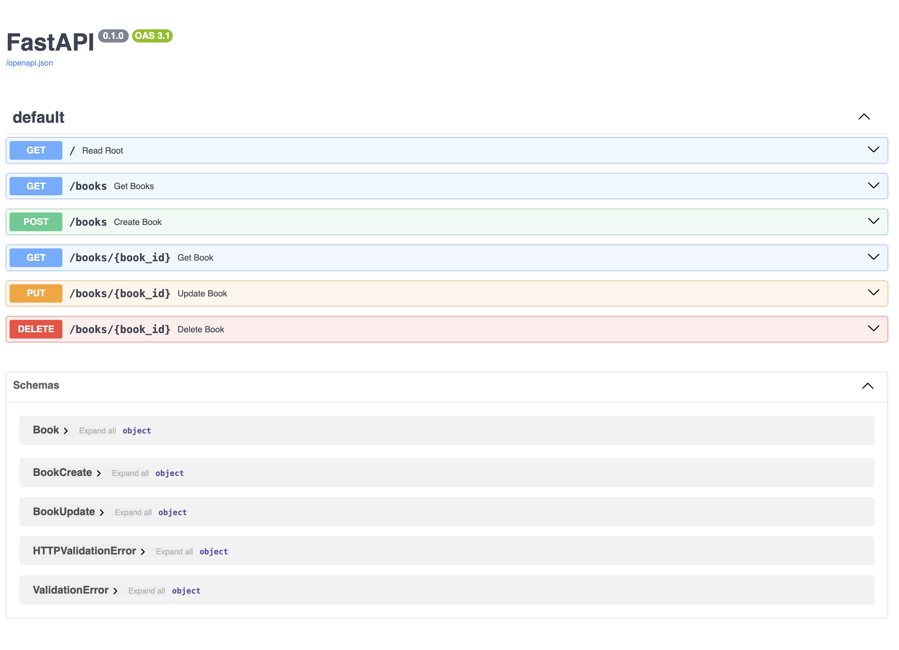
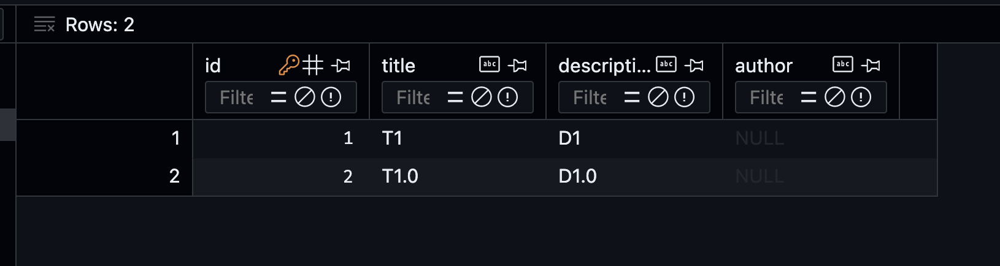

# FastAPI Books CRUD API

This is a simple FastAPI application that demonstrates CRUD operations for managing books using an SQLite database.



## Project Details

* **Database** : SQLite
* **ORM** : SQLAlchemy
* **Web Framework** : FastAPI
* **Server** : Uvicorn

## Setup Instructions

### 1. Clone the Repository

```bash
git clone https://github.com/prograamer/fastapi_books_crud.git
cd fastapi_books_crud
```

### 2. Create a Virtual Environment

Create and activate a virtual environment to manage dependencies.

```
python -m venv env
source env/bin/activate  # On Windows, use env\Scripts\activate
```

### 3. Install Dependencies

Install the required dependencies from the `requirements.txt` file.

`pip install -r requirements.txt`

### 4. Run the Application

Start the FastAPI application using Uvicorn.

```
uvicorn app.main:app --reload
```

### 5. Run the Application

Go to `http://localhost:8000/docs`


## Adding a New Field Using Alembic

When you need to modify your database schema, such as adding a new field to a model, you can use Alembic to handle the migrations. Follow these steps to add a new field and migrate the database:

### 1. Make Model Changes

Add the new field to your model in `app/models.py`:

```
from sqlalchemy import Column, Integer, String
from app.database import Baseclass Book(Base):
    tablename = "books"    id = Column(Integer, primary_key=True, index=True)
    title = Column(String, index=True)
    author = Column(String, index=True)  # New field
    description = Column(String, index=True)
```

Update the schema in `app/schemas.py` to include the new field:

```
from pydantic import BaseModelclass BookBase(BaseModel):
    title: str
    author: str  # New field
    description: str = Noneclass BookCreate(BookBase):
    passclass BookUpdate(BookBase):
    passclass Book(BookBase):
    id: int    class Config:
        orm_mode = True
```

### 2. Install Alembic

If you haven't already installed Alembic, install it using pip:

```
pip install alembic
```

### 3. Initialize Alembic

In your project root directory, initialize Alembic:

```
alembic init alembic
```

This will create an `alembic` directory with configuration files.

### 4. Configure Alembic

Edit the `alembic.ini` file in your project root directory and set the SQLAlchemy URL:

```
sqlalchemy.url = sqlite:///./app.db
```

Edit `alembic/env.py` to include your models:

```
# add your model's MetaData object here
# for 'autogenerate' support
from app.models import Base -------> add this line
target_metadata = Base.metadata -------> add this line
```

### 5. Create a Migration Script

Generate a new migration script to capture the changes in your models:

`alembic revision --autogenerate -m "Added author field to books"`

### 6. Apply the Migration

Run the migration to apply the changes to the database:

`alembic upgrade head`

### 7. Check SQLite Database

Check app.db to see the newly created field in the database.
